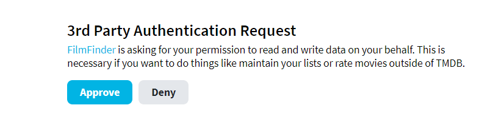
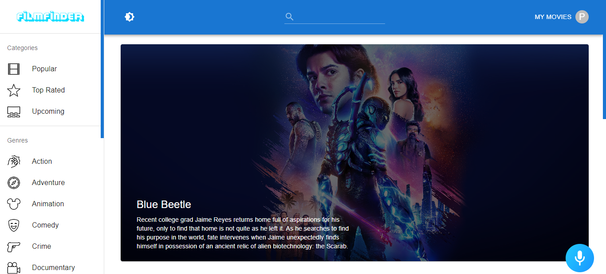
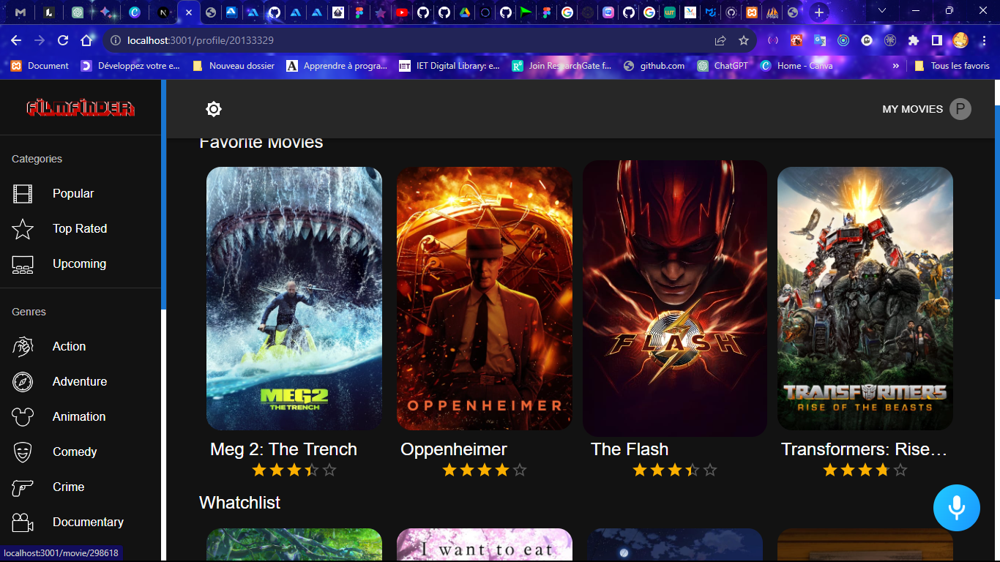
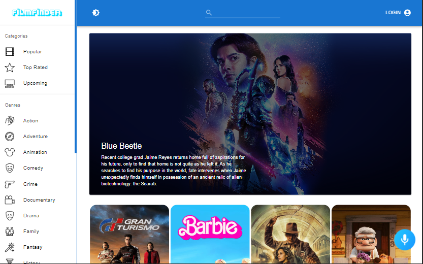
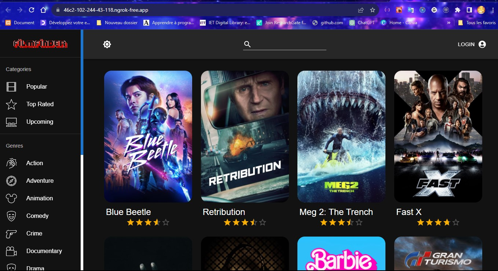
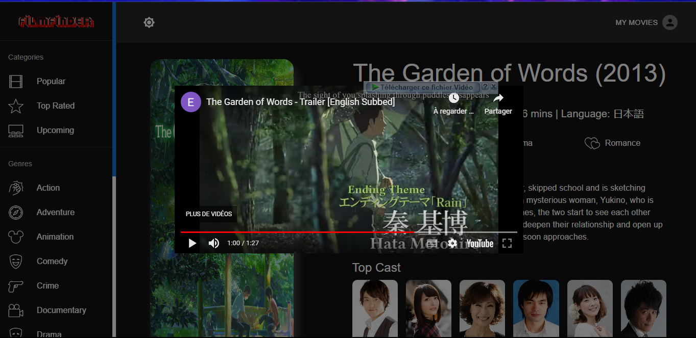

### [😀Click Here to joins US](https://ngcodex.com/dev-session/#newuser)
# Film Finder

Film Finder is a cutting-edge movie search application that seamlessly merges creative excellence with state-of-the-art technologies. Leveraging React.js for its dynamic user interface, Redux Toolkit for robust state management, Material UI for sleek design elements, and Alan AI for innovative voice functionalities, the app delivers an unparalleled user experience.

## Functionalities

### User Authentication and Account Management
Film Finder provides secure user authentication, allowing users to create accounts, log in, and log out seamlessly. Users can manage their account settings and preferences.




### Intuitive Search Capabilities
Search for movies effortlessly using either text input or voice commands. Alan AI acts as an in-app voice assistant, enabling intuitive conversational experiences for Film Finder users.




### Personalized Watchlist and Favorites
Users can curate their movie preferences by adding films to their watchlist and favorites. Movies can be effortlessly added or removed, ensuring a tailored viewing experience.




### Dynamic Sorting and Filtering
Explore movies based on genres and categories, enhancing the browsing experience. The application allows dynamic sorting and filtering, ensuring users find movies that align with their interests effortlessly.

### Adaptive User Interface
Film Finder boasts a responsive design that adapts seamlessly to various screen platforms. Whether on a desktop, tablet, or smartphone, users can enjoy a consistent and user-friendly interface.   


### Dark Mode for Enhanced Viewing
Enhance your viewing experience with Film Finder's dark mode. Switch effortlessly between light and dark modes to suit your preference and reduce eye strain during nighttime usage.



### Voice-Activated & Trailer Features 
Utilize voice commands for tasks such as logging in, searching for movies, and managing your watchlist. Alan AI's voice functionalities make navigation effortless, enhancing accessibility and user convenience.Watch the trailer of a movie and then watchlist it to see it later.
   

---


## Installation

To run Film Finder locally on your machine, follow these steps:

1. **Clone the Repository:**
   ```
   git clone https://github.com/Nde-Dilan/FilmFinder.git
   ```

2. **Navigate to the Project Directory:**
   ```
   cd FilmFinder
   ```

3. **Install Dependencies:**
   ```
   npm install
   ```

4. **Run the Application:**
   ```
   npm start
   ```

5. **Access the Application:**
   Open your web browser and visit [http://localhost:3000](http://localhost:3000).

## Contributing

We welcome contributions to Film Finder! To contribute, follow these steps:

1. **Fork the Repository**
   
2. **Clone your Fork:**
   ```
   git clone https://github.com/your-username/film-finder.git
   ```

3. **Create a Branch:**
   ```
   git checkout -b feature-name
   ```

4. **Make Changes, Add Features, Fix Bugs**

5. **Commit Changes:**
   ```
   git commit -m "Your descriptive commit message"
   ```

6. **Push to the Branch:**
   ```
   git push origin feature-name
   ```

7. **Create a Pull Request**
   - Go to your fork on GitHub and click on "New Pull Request."
   - Provide a descriptive title and overview of the changes.
   - Submit the Pull Request for review.

## License

This project is licensed under the [MIT License](LICENSE).

---

### [😀Click Here to joins US](https://ngcodex.com/dev-session/#newuser)
